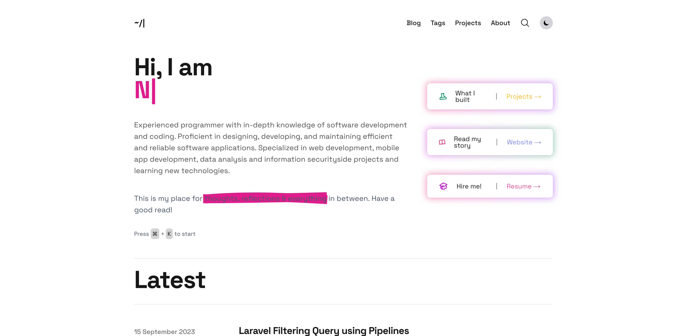

# Wach Blog & Portfolio

[](https://nextjs.org/)
[](https://reactjs.org/)
[](https://www.typescriptlang.org/)
[](https://tailwindcss.com/)
[](LICENSE)
[](https://vercel.com)

A modern, fast, and SEO-optimized blog and portfolio website built with Next.js 15, Tailwind CSS 4, and Contentlayer. This project was forked and modified from [tailwind starter blog](https://github.com/timlrx/tailwind-nextjs-starter-blog).



## ✨ Features

- ⚡ **Next.js 15** - Latest React framework with App Router
- 🎨 **Tailwind CSS 4** - Utility-first CSS framework
- 📝 **Contentlayer** - Type-safe content management
- 🔍 **SEO Optimized** - Built-in SEO features and metadata
- 🌙 **Dark Mode** - System, light, and dark theme support
- 📱 **Responsive Design** - Mobile-first approach
- 🚀 **Performance** - Optimized for speed and Core Web Vitals
- 📊 **Analytics** - Support for Umami, Plausible, and Google Analytics
- 💬 **Comments** - Giscus, Utterances, and Disqus integration
- 🔎 **Search** - Kbar and Algolia search support
- 📧 **Newsletter** - Mailchimp, Buttondown, and other providers
- 🎯 **TypeScript** - Full TypeScript support
- 📄 **MDX Support** - Enhanced markdown with React components
- 🎵 **Sound Effects** - Interactive sound feedback
- 📈 **Reading Time** - Automatic reading time calculation
- 🏷️ **Tag System** - Organized content categorization

## 🚀 Quick Start

### Prerequisites

- Node.js 18+ 
- Yarn (recommended) or npm

### Installation

1. Clone the repository:
```bash
git clone https://github.com/turahe/blog.git
cd blog
```

2. Install dependencies:
```bash
yarn install
```

**Note for Windows users:** You may need to run:
```powershell
$env:PWD = $(Get-Location).Path
```

### Development

Start the development server:

```bash
yarn dev
```

Open [http://localhost:3000](http://localhost:3000) with your browser to see the result.

The pages auto-update as you edit them with live reloading.

## 🛠️ Build & Deploy

### Build for Production

```bash
yarn build
```

### Start Production Server

```bash
yarn serve
```

### Static Export

For static hosting services (GitHub Pages, S3, Firebase, etc.):

```bash
EXPORT=1 UNOPTIMIZED=1 yarn build
```

**For URL base path deployment** (e.g., `https://example.org/myblog`):
```bash
EXPORT=1 UNOPTIMIZED=1 BASE_PATH=/myblog yarn build
```

## 🎨 Customization

### Site Configuration

- `data/siteMetadata.js` - Main site information and metadata
- `data/authors/default.mdx` - Default author information
- `data/projectsData.ts` - Projects page data
- `data/headerNavLinks.ts` - Navigation links
- `data/logo.svg` - Site logo

### Content Management

- `data/blog/` - Blog posts (MDX format)
- `data/authors/` - Author profiles
- `public/static/` - Static assets (images, favicons, sounds)

### Styling

- `tailwind.config.js` - Tailwind CSS configuration
- `css/tailwind.css` - Custom CSS styles
- `css/prism.css` - Code block syntax highlighting
- `css/extra.css` - Additional custom styles

### Components

- `components/MDXComponents.tsx` - Custom MDX components
- `layouts/` - Page layout templates
- `app/` - Next.js App Router pages

### Contentlayer Configuration

- `contentlayer.config.ts` - Content schema and MDX plugins

## 📝 Blog Posts

### Frontmatter

Posts use Hugo-style frontmatter with the following fields:

```yaml
---
title: 'Your Post Title'
date: '2024-01-01'
lastmod: '2024-01-15'
tags: ['next-js', 'tailwind', 'guide']
draft: false
summary: 'Brief description of your post'
images: ['/static/images/post-image.jpg']
authors: ['default']
layout: PostLayout
canonicalUrl: https://wach.id/blog/your-post-url
---
```

### Supported Fields

- `title` (required) - Post title
- `date` (required) - Publication date
- `tags` (optional) - Content tags
- `lastmod` (optional) - Last modification date
- `draft` (optional) - Draft status
- `summary` (optional) - Post summary
- `images` (optional) - Featured images
- `authors` (optional) - Author list
- `layout` (optional) - Layout template
- `canonicalUrl` (optional) - Canonical URL for SEO

## 🚀 Deployment

### Vercel (Recommended)

The easiest way to deploy is using [Vercel](https://vercel.com):

1. Push your code to GitHub
2. Import your repository to Vercel
3. Deploy automatically

### Netlify

[Netlify](https://www.netlify.com/) provides excellent Next.js support:

1. Connect your repository
2. Build command: `yarn build`
3. Publish directory: `.next`

### GitHub Pages

Use the provided GitHub Actions workflow:

1. Enable GitHub Actions in your repository
2. Select "GitHub Actions" in Settings > Pages > Build and deployment > Source
3. The workflow will automatically build and deploy your site

### Static Hosting

For static hosting services:

```bash
EXPORT=1 UNOPTIMIZED=1 yarn build
```

Then deploy the generated `out` folder.

## 🔧 Configuration

### Analytics

Configure analytics in `data/siteMetadata.js`:

```javascript
analytics: {
  umamiAnalytics: {
    umamiWebsiteId: process.env.NEXT_UMAMI_ID,
    src: process.env.NEXT_UMAMI_SRC,
  },
  // Other providers: plausibleAnalytics, simpleAnalytics, posthogAnalytics, googleAnalytics
}
```

### Comments

Set up comments in `data/siteMetadata.js`:

```javascript
comments: {
  provider: 'giscus', // giscus, utterances, disqus
  giscusConfig: {
    repo: process.env.NEXT_PUBLIC_GISCUS_REPO,
    repositoryId: process.env.NEXT_PUBLIC_GISCUS_REPOSITORY_ID,
    // ... other config
  }
}
```

### Newsletter

Configure newsletter in `data/siteMetadata.js`:

```javascript
newsletter: {
  provider: 'mailchimp', // mailchimp, buttondown, convertkit, klaviyo, revue, emailoctopus
}
```

## 📦 Scripts

- `yarn dev` - Start development server
- `yarn build` - Build for production
- `yarn serve` - Start production server
- `yarn lint` - Run ESLint
- `yarn analyze` - Analyze bundle size
- `yarn test` - Run tests
- `yarn test:watch` - Run tests in watch mode
- `yarn test:coverage` - Run tests with coverage report
- `yarn test:ci` - Run tests for CI environment

## 🔄 CI/CD Pipeline

This project uses GitHub Actions for continuous integration and deployment:

### Workflows

- **CI** (`ci.yml`) - Runs on every push and PR
  - Linting and type checking
  - Building the project
  - Security audits
  - Performance analysis

- **Deploy** (`deploy.yml`) - Deploys to Vercel on main branch
  - Automatic deployment to production
  - Requires Vercel secrets configuration

- **Static Export** (`static-export.yml`) - Creates static build
  - Exports static files for hosting
  - Deploys to GitHub Pages
  - Uploads build artifacts

- **Dependency Review** (`dependency-review.yml`) - Security checks
  - Reviews dependencies for vulnerabilities
  - Runs on every PR

- **CodeQL** (`codeql.yml`) - Advanced security analysis
  - Static code analysis
  - Vulnerability detection
  - Scheduled weekly scans

### Required Secrets

For deployment workflows, you'll need to configure these secrets in your GitHub repository:

#### Vercel Deployment
- `VERCEL_TOKEN` - Your Vercel API token
- `VERCEL_ORG_ID` - Your Vercel organization ID
- `VERCEL_PROJECT_ID` - Your Vercel project ID

#### How to get Vercel secrets:
1. Install Vercel CLI: `npm i -g vercel`
2. Run `vercel login`
3. Run `vercel link` in your project
4. Check `.vercel/project.json` for org and project IDs
5. Get token from [Vercel dashboard](https://vercel.com/account/tokens)

### Status Badges

Add these badges to your README to show CI status:

```markdown


```

## 🧪 Testing

This project includes comprehensive unit tests to ensure code quality and reliability.

### Test Structure

- `__tests__/utils/` - Utility function tests
- `__tests__/data/` - Data validation tests
- `__tests__/components/` - Component tests
- `__tests__/setup/` - Test utilities and setup

### Test Coverage

The test suite covers:
- **Data Validation** - Site metadata, navigation links, projects, and experience data
- **Utility Functions** - Date formatting, text truncation, URL validation, email validation
- **Component Testing** - React component rendering and interactions
- **Configuration** - Jest setup and mocking

### Running Tests

```bash
# Run all tests
yarn test

# Run tests in watch mode
yarn test:watch

# Run tests with coverage
yarn test:coverage

# Run tests for CI
yarn test:ci
```

### Test Configuration

- **Jest** - Testing framework
- **React Testing Library** - Component testing utilities
- **jsdom** - DOM environment for testing
- **Coverage Threshold** - 70% minimum coverage required

### Writing Tests

Tests follow these conventions:
- Use descriptive test names
- Test both success and failure cases
- Mock external dependencies
- Validate data structures
- Test accessibility features

## 🤝 Contributing

1. Fork the repository
2. Create your feature branch (`git checkout -b feature/amazing-feature`)
3. Commit your changes (`git commit -m 'Add some amazing feature'`)
4. Push to the branch (`git push origin feature/amazing-feature`)
5. Open a Pull Request

## 📄 License

This project is licensed under a Proprietary License - see the [LICENSE](LICENSE) file for details.

**Important:** This software is proprietary and confidential. All rights are reserved by Nur Wachid. 
This project is provided for personal, non-commercial use only. Commercial use, redistribution, 
modification, or derivative works require explicit written permission from the copyright holder.

For licensing inquiries, please contact:
- **Email:** wachid@outlook.com
- **Website:** https://wach.id
- **GitHub:** https://github.com/turahe

## 🙏 Acknowledgments

- Original template by [Timothy Lin](https://github.com/timlrx/tailwind-nextjs-starter-blog)
- Built with [Next.js](https://nextjs.org/), [Tailwind CSS](https://tailwindcss.com/), and [Contentlayer](https://www.contentlayer.dev/)

---

**Built with ❤️ by [Nur Wachid](https://wach.id)**
